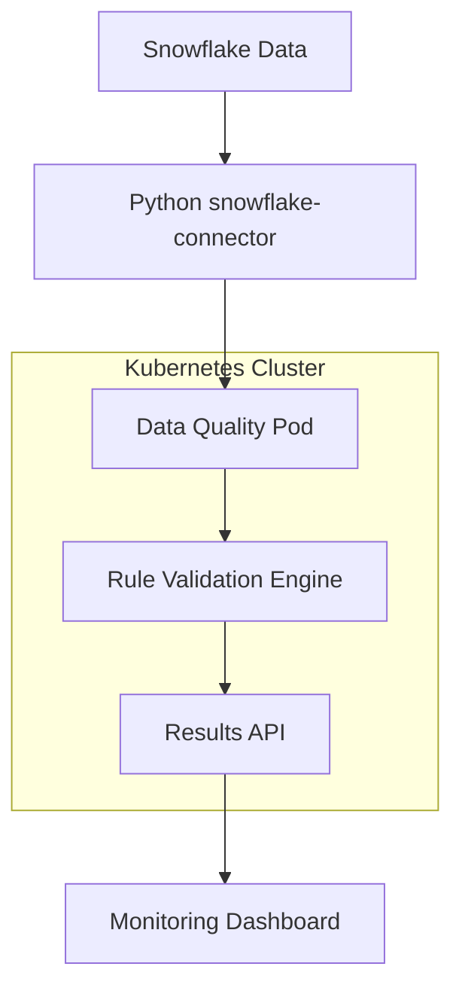

# 📊 Open-Source Data Quality Tools for Snowflake

> **Comprehensive comparison of top data quality tools that run as standalone Kubernetes pods with Snowflake integration**

[](https://snowflake.com)
[](https://kubernetes.io)
[](https://opensource.org)

## 🎯 Overview

This analysis covers the top open-source data quality tools that meet these critical requirements:

1. **Standalone Pod Capability** - Run as independent Kubernetes pods
1. **Open Source** - Free and community-driven
1. **Docker Ready** - Available as ready-made Docker images
1. **Proven & Popular** - Battle-tested with strong community support

-----

## 🛠️ Ready-Made Solutions

### 1. Great Expectations ⭐ **RECOMMENDED**

|**Metric**               |**Details**                                                     |
|-------------------------|----------------------------------------------------------------|
|**Language**             |Python                                                          |
|**GitHub Stars**         |⭐ 9,800+                                                        |
|**Docker/K8s**           |✅ **Excellent** - Official Docker images, cloud deployment ready|
|**Snowflake Integration**|✅ **Native** - Official partnership, native SQL execution       |
|**Community**            |500+ contributors, very active, enterprise support              |

**Usage:**

- Python-based framework using “Expectations” (unit tests for data)
- Translates tests into SQL queries executed directly on Snowflake
- Uses Checkpoints for orchestrated validation runs

**Pros:**

- ✅ Most mature and widely adopted tool
- ✅ Excellent Snowflake integration with official partnership
- ✅ Strong documentation and community support
- ✅ Automatic documentation generation
- ✅ Enterprise support available

**Cons:**

- ❌ Python-centric (requires Python expertise)
- ❌ Can be complex for simple use cases
- ❌ Limited native Kubernetes orchestration

**Example Implementation:**

```python
from great_expectations import DataContext
context = DataContext()
validator = context.get_validator(
    batch_request=BatchRequest(datasource_name="snowflake_db"),
    expectation_suite_name="data_quality_suite"
)
validator.expect_column_values_to_not_be_null("user_id")
validator.expect_column_values_to_be_unique("customer_id")
```

-----

### 2. Soda Core ⭐ **CLOUD-NATIVE CHOICE**

|**Metric**               |**Details**                                               |
|-------------------------|----------------------------------------------------------|
|**Language**             |Python                                                    |
|**GitHub Stars**         |⭐ 2,800+                                                  |
|**Docker/K8s**           |✅ **Excellent** - Self-hosted Soda Agent, Helm charts     |
|**Snowflake Integration**|✅ **Native** - Real-time monitoring, multiple auth methods|
|**Community**            |100+ contributors, growing fast, commercial backing       |

**Usage:**

- Modern Python library using SodaCL (YAML-based) for data quality checks
- Converts checks to SQL queries executed on Snowflake
- Self-hosted agent designed for containerized environments

**Pros:**

- ✅ Modern, cloud-native design
- ✅ Excellent Kubernetes integration
- ✅ User-friendly YAML syntax
- ✅ Strong Snowflake support
- ✅ Good balance of simplicity and power

**Cons:**

- ❌ Newer tool with smaller community than Great Expectations
- ❌ Some advanced features require Soda Cloud
- ❌ Less extensive ecosystem

**Example Implementation:**

```yaml
checks for customer_data:
  - row_count between 1000 and 5000
  - missing_count(email) = 0
  - duplicate_count(customer_id) = 0
  - freshness(created_date) < 1d
```

-----

### 3. MobyDQ

|**Metric**               |**Details**                                      |
|-------------------------|-------------------------------------------------|
|**Language**             |Python                                           |
|**GitHub Stars**         |⭐ 500+                                           |
|**Docker/K8s**           |✅ **Good** - Docker Compose, limited K8s examples|
|**Snowflake Integration**|✅ **Basic** - Standard database connectors       |
|**Community**            |Ubisoft-backed, smaller but stable               |

**Usage:**

- Ubisoft-developed tool for automated data quality checks
- Uses GraphQL API and web-based interface
- Docker-compose based deployment with PostgreSQL backend

**Pros:**

- ✅ Fully containerized design
- ✅ Web-based interface
- ✅ GraphQL API
- ✅ Complete Docker solution

**Cons:**

- ❌ Smaller community
- ❌ Less active development
- ❌ Limited advanced features
- ❌ Fewer integrations

-----

## 💻 Programming Libraries

### 1. Pandera (Python) ⭐ **PYTHON CHOICE**

|**Metric**               |**Details**                                              |
|-------------------------|---------------------------------------------------------|
|**GitHub Stars**         |⭐ 3,200+                                                 |
|**Docker/K8s**           |✅ **Excellent** - Pure Python, microservice ready        |
|**Snowflake Integration**|✅ **Excellent** - Direct via Ibis backend, pandas support|
|**Community**            |Union.ai backing, 50+ contributors, very active          |

**Usage:**

- Framework for precision data testing with statistical typing
- Define schemas once and validate multiple dataframe types
- Supports Ibis backend for direct Snowflake validation

**Example Implementation:**

```python
import pandera.pandas as pa
import snowflake.connector

class SalesSchema(pa.DataFrameModel):
    transaction_id: int = pa.Field(ge=0, unique=True)
    amount: float = pa.Field(ge=0, le=100000)
    customer_id: str = pa.Field(regex=r'^CUST_\d+$')

conn = snowflake.connector.connect(...)
df = pd.read_sql("SELECT * FROM sales_data", conn)
validated_df = SalesSchema.validate(df, lazy=True)
```

-----

### 2. go-playground/validator (Go) ⭐ **GO CHOICE**

|**Metric**               |**Details**                                      |
|-------------------------|-------------------------------------------------|
|**GitHub Stars**         |⭐ 18,900+                                        |
|**Docker/K8s**           |✅ **Excellent** - Lightweight binary, thread-safe|
|**Snowflake Integration**|✅ **Good** - Works with gosnowflake driver       |
|**Community**            |Extremely popular, very active maintenance       |

**Usage:**

- Comprehensive struct and field validation using struct tags
- Cross-field validation, built-in validators, custom functions
- Default validator for Gin framework

**Example Implementation:**

```go
type SnowflakeData struct {
    ID       int64  `validate:"required,min=1"`
    Email    string `validate:"required,email"`
    Status   string `validate:"oneof=active inactive"`
}

db, err := sql.Open("snowflake", "user:password@account/database")
// Fetch and validate data
```

-----

## 🚀 Kubernetes Deployment Examples

### Universal Deployment Pattern

```yaml
apiVersion: apps/v1
kind: Deployment
metadata:
  name: data-quality-service
spec:
  replicas: 3
  template:
    spec:
      containers:
      - name: quality-service
        image: your-dq-solution:latest
        ports:
        - containerPort: 8000
        env:
        - name: SNOWFLAKE_ACCOUNT
          valueFrom:
            secretKeyRef:
              name: snowflake-credentials
              key: account
```

### Scheduled Quality Checks

```yaml
apiVersion: batch/v1
kind: CronJob
metadata:
  name: hourly-quality-check
spec:
  schedule: "0 * * * *"
  jobTemplate:
    spec:
      template:
        spec:
          containers:
          - name: quality-checker
            image: data-quality:latest
            command: ["python", "scheduled_check.py"]
```

-----

## 📈 Comparison Matrix

|**Tool**                   |**Language**|**Stars**|**K8s Ready**|**Snowflake**|**Best For**                    |
|---------------------------|------------|---------|-------------|-------------|--------------------------------|
|**Great Expectations**     |Python      |9,800+   |✅            |✅ Native     |**Immediate implementation**    |
|**Soda Core**              |Python      |2,800+   |✅            |✅ Native     |**Cloud-native environments**   |
|**MobyDQ**                 |Python      |500+     |⚠️            |⚠️ Basic      |**Simple containerized setups** |
|**Pandera**                |Python      |3,200+   |✅            |✅            |**Custom Python development**   |
|**go-playground/validator**|Go          |18,900+  |✅            |✅            |**High-performance Go services**|

-----

## 🎯 Recommendations

### 🥇 **For Immediate Implementation**

**Choose: Great Expectations**

- Best balance of maturity, Snowflake integration, and community support
- Official Snowflake partnership ensures long-term compatibility
- Extensive documentation and enterprise support available

### ☁️ **For Cloud-Native Environments**

**Choose: Soda Core**

- Most modern Kubernetes-first approach
- Excellent Snowflake connectivity with real-time monitoring
- Built specifically for containerized environments

### 🐍 **For Custom Python Development**

**Choose: Pandera**

- Powerful statistical validation capabilities
- Direct Snowflake integration via multiple backends
- Type-safe programming with excellent documentation

### ⚡ **For High-Performance Go Services**

**Choose: go-playground/validator**

- Lightweight, single binary deployment
- Thread-safe for concurrent processing
- Works seamlessly with gosnowflake driver

-----

## 🔧 Integration Architecture



-----

## 📋 Implementation Checklist

- [ ] Choose primary tool based on your team’s language preference
- [ ] Set up Snowflake connection credentials in Kubernetes secrets
- [ ] Configure Docker images for your chosen solution
- [ ] Define data quality rules for your specific use cases
- [ ] Set up monitoring and alerting for quality check results
- [ ] Implement CI/CD pipeline for rule updates
- [ ] Train team on chosen tool’s syntax and best practices

-----

## 🤝 Contributing

Found this comparison helpful? Consider:

- ⭐ Starring this repository
- 🍴 Forking for your own customizations
- 📝 Opening issues for additional tools to evaluate
- 🔄 Submitting PRs with updates or corrections

-----

## 📚 Additional Resources

- [Snowflake Data Quality Best Practices](https://docs.snowflake.com/en/user-guide/data-quality)
- [Kubernetes ConfigMaps for DQ Rules](https://kubernetes.io/docs/concepts/configuration/configmap/)
- [Docker Best Practices for Data Applications](https://docs.docker.com/develop/dev-best-practices/)

-----

**Last Updated:** September 2025  
**Maintained by:** Data Engineering Community
