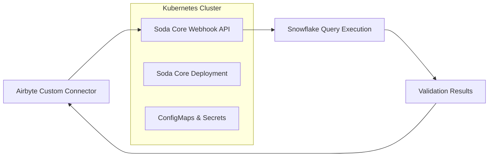

# 🔍 Soda Core vs Great Expectations: Complete Comparison & Implementation Guide

> **Choose the right data quality tool for your Airbyte + Snowflake + Kubernetes setup**

[](https://github.com/sodadata/soda-core)
[](https://github.com/great-expectations/great_expectations)
[](https://kubernetes.io)
[](https://snowflake.com)

-----

## 🏆 **TL;DR - Quick Recommendation**

**For Airbyte Custom Connectors + Snowflake + Kubernetes:**

- 🥇 **Choose Soda Core** → Simple, fast, Kubernetes-native
- 🥈 **Choose Great Expectations** → Advanced features, complex setup

-----

## 📊 **Side-by-Side Comparison**

|**Criteria**                |**🎯 Soda Core**    |**🔧 Great Expectations**|**Winner**              |
|----------------------------|-------------------|------------------------|------------------------|
|**Setup Time**              |⏱️ 30 minutes       |⏱️ 2-3 weeks             |🏆 **Soda Core**         |
|**Learning Curve**          |📚 1 day            |📚 2-4 weeks             |🏆 **Soda Core**         |
|**Configuration**           |✅ Simple YAML      |❌ Complex Python + YAML |🏆 **Soda Core**         |
|**Custom Queries**          |✅ Native support   |⚠️ Complex setup         |🏆 **Soda Core**         |
|**Kubernetes Integration**  |✅ Helm charts ready|⚠️ Manual deployment     |🏆 **Soda Core**         |
|**Resource Usage**          |💚 256MB RAM        |🔴 1-4GB RAM             |🏆 **Soda Core**         |
|**Business User Friendly**  |✅ YAML config      |❌ Python coding         |🏆 **Soda Core**         |
|**Advanced Features**       |⚠️ Basic            |✅ Rich ecosystem        |🏆 **Great Expectations**|
|**Data Profiling**          |❌ Limited          |✅ Automatic             |🏆 **Great Expectations**|
|**Documentation Generation**|⚠️ Basic            |✅ Rich HTML             |🏆 **Great Expectations**|

-----

## 🎯 **Implementation Complexity**

### **Soda Core - Simple & Clean**

```yaml
# ✅ This is ALL you need!
data_source airbyte_snowflake:
  type: snowflake
  host: account.snowflakecomputing.com
  username: user
  password: pass

checks for my_custom_query:
  - query: |
      SELECT user_id, email, age 
      FROM users 
      WHERE sync_date = CURRENT_DATE
  - row_count > 1000
  - missing_count(email) = 0
  - duplicate_count(user_id) = 0
```

**📏 Total Setup: ~15 lines of config**

### **Great Expectations - Complex but Powerful**

```python
# ❌ Just a sample - actual implementation is 500+ lines
import great_expectations as gx

# 1. Create context and datasource (50+ lines of config)
context = gx.get_context()
datasource = context.add_datasource(...)

# 2. Create expectation suite (100+ lines)
suite = context.create_expectation_suite(...)
validator = context.get_validator(...)

# 3. Add expectations (simpler part)
validator.expect_table_row_count_to_be_between(min_value=1000)
validator.expect_column_values_to_not_be_null("user_id")

# 4. Create checkpoints (50+ lines)
# 5. Configure data docs (30+ lines)
# 6. Set up validation actions (50+ lines)
```

**📏 Total Setup: ~500+ lines of code + config**

-----

## 🚀 **Complete Implementation Example**

### **Scenario**: Airbyte Custom Connector → Soda Core Webhook → Snowflake Validation



-----

## 📁 **1. Airbyte Custom Connector Integration**

### **Airbyte Connector Code**

```python
# airbyte_connector.py
import requests
import json
from typing import Dict, Any

class CustomSnowflakeConnector:
    def __init__(self, config: Dict[str, Any]):
        self.config = config
        self.soda_webhook_url = config.get('soda_webhook_url', 'http://soda-core-service:8080')
    
    def extract_with_validation(self, custom_query: str):
        """Extract data and validate using Soda Core webhook"""
        
        # 1. Prepare validation request
        validation_request = {
            "custom_query": custom_query,
            "validation_rules": {
                "min_row_count": 1000,
                "required_columns": ["user_id", "email"],
                "unique_columns": ["user_id"],
                "business_rules": [
                    "age BETWEEN 0 AND 130",
                    "email LIKE '%@%.%'"
                ]
            },
            "connector_id": self.config.get('connector_id'),
            "sync_timestamp": "2024-01-01T00:00:00Z"
        }
        
        # 2. Call Soda Core webhook
        try:
            response = requests.post(
                f"{self.soda_webhook_url}/validate",
                json=validation_request,
                timeout=300
            )
            
            if response.status_code == 200:
                validation_results = response.json()
                
                if validation_results['status'] == 'success':
                    # Proceed with data extraction
                    return self._extract_data(custom_query)
                else:
                    # Handle validation failures
                    raise Exception(f"Data quality validation failed: {validation_results['errors']}")
            else:
                raise Exception(f"Soda webhook error: {response.status_code}")
                
        except requests.exceptions.Timeout:
            raise Exception("Soda validation timeout")
    
    def _extract_data(self, query: str):
        """Your existing data extraction logic"""
        pass
```

### **Airbyte Spec.json**

```json
{
  "documentationUrl": "https://docs.airbyte.io/integrations/sources/custom-snowflake",
  "connectionSpecification": {
    "type": "object",
    "required": ["snowflake_config", "custom_query"],
    "properties": {
      "snowflake_config": {
        "title": "Snowflake Connection",
        "type": "object",
        "properties": {
          "host": {"type": "string", "title": "Host"},
          "username": {"type": "string", "title": "Username"},
          "password": {"type": "string", "title": "Password", "airbyte_secret": true}
        }
      },
      "custom_query": {
        "type": "string",
        "title": "Custom SQL Query",
        "description": "Your custom Snowflake query for data extraction",
        "multiline": true,
        "examples": ["SELECT user_id, email, age FROM users WHERE created_at >= CURRENT_DATE - 7"]
      },
      "soda_webhook_url": {
        "type": "string", 
        "title": "Soda Core Webhook URL",
        "default": "http://soda-core-service:8080",
        "description": "URL of the Soda Core validation service"
      },
      "enable_data_quality": {
        "type": "boolean",
        "title": "Enable Data Quality Validation", 
        "default": true
      }
    }
  }
}
```

-----

## 🐳 **2. Soda Core Webhook API Service**

### **Flask Webhook Server**

```python
# soda_webhook_service.py
from flask import Flask, request, jsonify
import subprocess
import tempfile
import yaml
import json
import os
from pathlib import Path

app = Flask(__name__)

class SodaValidator:
    def __init__(self):
        self.snowflake_config = {
            'host': os.getenv('SNOWFLAKE_HOST'),
            'username': os.getenv('SNOWFLAKE_USER'),
            'password': os.getenv('SNOWFLAKE_PASSWORD'),
            'database': os.getenv('SNOWFLAKE_DATABASE'),
            'schema': os.getenv('SNOWFLAKE_SCHEMA'),
            'warehouse': os.getenv('SNOWFLAKE_WAREHOUSE')
        }
    
    def validate_query(self, custom_query: str, validation_rules: dict):
        """Validate custom query using Soda Core"""
        
        # Create Soda configuration
        soda_config = {
            'data_source': {
                'airbyte_snowflake': {
                    'type': 'snowflake',
                    **self.snowflake_config
                }
            }
        }
        
        # Create validation checks
        checks = self._build_checks(custom_query, validation_rules)
        
        # Execute Soda scan
        with tempfile.TemporaryDirectory() as temp_dir:
            config_path = Path(temp_dir) / 'config.yml'
            checks_path = Path(temp_dir) / 'checks.yml'
            
            with open(config_path, 'w') as f:
                yaml.dump(soda_config, f)
            
            with open(checks_path, 'w') as f:
                yaml.dump(checks, f)
            
            try:
                result = subprocess.run([
                    'soda', 'scan',
                    '-d', 'airbyte_snowflake',
                    '-c', str(config_path),
                    str(checks_path),
                    '--format', 'json'
                ], capture_output=True, text=True, timeout=300)
                
                return self._parse_results(result.stdout, result.stderr)
                
            except subprocess.TimeoutExpired:
                return {'status': 'timeout', 'error': 'Validation timeout'}
    
    def _build_checks(self, query: str, rules: dict):
        """Build Soda checks from validation rules"""
        checks = {
            'queries': {
                'custom_validation_query': query
            },
            'checks for custom_validation_query': []
        }
        
        # Add basic checks
        if 'min_row_count' in rules:
            checks['checks for custom_validation_query'].append(
                f"row_count >= {rules['min_row_count']}"
            )
        
        if 'required_columns' in rules:
            for col in rules['required_columns']:
                checks['checks for custom_validation_query'].append(
                    f"missing_count({col}) = 0"
                )
        
        if 'unique_columns' in rules:
            for col in rules['unique_columns']:
                checks['checks for custom_validation_query'].append(
                    f"duplicate_count({col}) = 0"
                )
        
        if 'business_rules' in rules:
            for rule in rules['business_rules']:
                checks['checks for custom_validation_query'].append({
                    'failed rows': {
                        'fail condition': f"NOT ({rule})"
                    }
                })
        
        return checks
    
    def _parse_results(self, stdout: str, stderr: str):
        """Parse Soda scan results"""
        if stderr:
            return {'status': 'error', 'error': stderr}
        
        try:
            results = json.loads(stdout)
            return {
                'status': 'success' if results.get('hasFailures', True) == False else 'failed',
                'results': results
            }
        except json.JSONDecodeError:
            return {'status': 'error', 'error': 'Failed to parse results'}

validator = SodaValidator()

@app.route('/validate', methods=['POST'])
def validate_data():
    """Webhook endpoint for Airbyte validation requests"""
    try:
        data = request.get_json()
        
        custom_query = data.get('custom_query')
        validation_rules = data.get('validation_rules', {})
        
        if not custom_query:
            return jsonify({'error': 'custom_query is required'}), 400
        
        # Execute validation
        results = validator.validate_query(custom_query, validation_rules)
        
        return jsonify(results)
        
    except Exception as e:
        return jsonify({'error': str(e)}), 500

@app.route('/health', methods=['GET'])
def health_check():
    """Health check endpoint"""
    return jsonify({'status': 'healthy'})

if __name__ == '__main__':
    app.run(host='0.0.0.0', port=8080)
```

-----

## ⚓ **3. Kubernetes Helm Chart**

### **Chart.yaml**

```yaml
# helm/soda-core/Chart.yaml
apiVersion: v2
name: soda-core-webhook
description: Soda Core data quality validation service for Airbyte
version: 1.0.0
appVersion: "3.0.45"
keywords:
  - data-quality
  - soda-core
  - airbyte
  - snowflake
home: https://github.com/your-org/soda-core-webhook
sources:
  - https://github.com/sodadata/soda-core
maintainers:
  - name: Your Team
    email: team@yourcompany.com
```

### **values.yaml**

```yaml
# helm/soda-core/values.yaml
replicaCount: 3

image:
  repository: your-registry/soda-core-webhook
  tag: "latest"
  pullPolicy: IfNotPresent

service:
  type: ClusterIP
  port: 80
  targetPort: 8080

# Snowflake connection configuration
snowflake:
  host: "account.snowflakecomputing.com"
  username: "soda_user"
  password: "secure_password"  # Use external secret in production
  database: "AIRBYTE_DB"
  schema: "RAW_DATA"
  warehouse: "COMPUTE_WH"
  role: "DATA_QUALITY_ROLE"

# Resource configuration
resources:
  requests:
    memory: "256Mi"
    cpu: "200m"
  limits:
    memory: "1Gi"
    cpu: "1000m"

# Autoscaling
autoscaling:
  enabled: true
  minReplicas: 2
  maxReplicas: 10
  targetCPUUtilizationPercentage: 70

# Health checks
livenessProbe:
  httpGet:
    path: /health
    port: 8080
  initialDelaySeconds: 30
  periodSeconds: 30

readinessProbe:
  httpGet:
    path: /health
    port: 8080
  initialDelaySeconds: 10
  periodSeconds: 10

# Security
securityContext:
  runAsNonRoot: true
  runAsUser: 1000
  fsGroup: 2000

# Service monitor for Prometheus
serviceMonitor:
  enabled: false
  labels: {}

# External secrets (recommended for production)
externalSecrets:
  enabled: false
  secretStore: vault
```

### **deployment.yaml**

```yaml
# helm/soda-core/templates/deployment.yaml
apiVersion: apps/v1
kind: Deployment
metadata:
  name: {{ include "soda-core-webhook.fullname" . }}
  labels:
    {{- include "soda-core-webhook.labels" . | nindent 4 }}
spec:
  replicas: {{ .Values.replicaCount }}
  selector:
    matchLabels:
      {{- include "soda-core-webhook.selectorLabels" . | nindent 6 }}
  template:
    metadata:
      labels:
        {{- include "soda-core-webhook.selectorLabels" . | nindent 8 }}
    spec:
      securityContext:
        {{- toYaml .Values.securityContext | nindent 8 }}
      containers:
        - name: soda-webhook
          image: "{{ .Values.image.repository }}:{{ .Values.image.tag }}"
          imagePullPolicy: {{ .Values.image.pullPolicy }}
          ports:
            - containerPort: 8080
              name: http
              protocol: TCP
          env:
            - name: SNOWFLAKE_HOST
              value: {{ .Values.snowflake.host }}
            - name: SNOWFLAKE_USER
              value: {{ .Values.snowflake.username }}
            - name: SNOWFLAKE_PASSWORD
              valueFrom:
                secretKeyRef:
                  name: {{ include "soda-core-webhook.fullname" . }}-secret
                  key: snowflake-password
            - name: SNOWFLAKE_DATABASE
              value: {{ .Values.snowflake.database }}
            - name: SNOWFLAKE_SCHEMA
              value: {{ .Values.snowflake.schema }}
            - name: SNOWFLAKE_WAREHOUSE
              value: {{ .Values.snowflake.warehouse }}
            - name: SNOWFLAKE_ROLE
              value: {{ .Values.snowflake.role }}
          livenessProbe:
            {{- toYaml .Values.livenessProbe | nindent 12 }}
          readinessProbe:
            {{- toYaml .Values.readinessProbe | nindent 12 }}
          resources:
            {{- toYaml .Values.resources | nindent 12 }}
```

### **service.yaml**

```yaml
# helm/soda-core/templates/service.yaml
apiVersion: v1
kind: Service
metadata:
  name: {{ include "soda-core-webhook.fullname" . }}
  labels:
    {{- include "soda-core-webhook.labels" . | nindent 4 }}
spec:
  type: {{ .Values.service.type }}
  ports:
    - port: {{ .Values.service.port }}
      targetPort: {{ .Values.service.targetPort }}
      protocol: TCP
      name: http
  selector:
    {{- include "soda-core-webhook.selectorLabels" . | nindent 4 }}
```

### **secret.yaml**

```yaml
# helm/soda-core/templates/secret.yaml
apiVersion: v1
kind: Secret
metadata:
  name: {{ include "soda-core-webhook.fullname" . }}-secret
  labels:
    {{- include "soda-core-webhook.labels" . | nindent 4 }}
type: Opaque
data:
  snowflake-password: {{ .Values.snowflake.password | b64enc }}
```

### **hpa.yaml**

```yaml
# helm/soda-core/templates/hpa.yaml
{{- if .Values.autoscaling.enabled }}
apiVersion: autoscaling/v2
kind: HorizontalPodAutoscaler
metadata:
  name: {{ include "soda-core-webhook.fullname" . }}
  labels:
    {{- include "soda-core-webhook.labels" . | nindent 4 }}
spec:
  scaleTargetRef:
    apiVersion: apps/v1
    kind: Deployment
    name: {{ include "soda-core-webhook.fullname" . }}
  minReplicas: {{ .Values.autoscaling.minReplicas }}
  maxReplicas: {{ .Values.autoscaling.maxReplicas }}
  metrics:
    - type: Resource
      resource:
        name: cpu
        target:
          type: Utilization
          averageUtilization: {{ .Values.autoscaling.targetCPUUtilizationPercentage }}
{{- end }}
```

-----

## 🚀 **Deployment Instructions**

### **1. Install Soda Core Helm Chart**

```bash
# Add your Helm repository
helm repo add your-repo https://your-charts-repo.com
helm repo update

# Install with custom values
helm install soda-core your-repo/soda-core-webhook \
  --set snowflake.host="account.snowflakecomputing.com" \
  --set snowflake.username="soda_user" \
  --set snowflake.password="secure_password" \
  --set snowflake.database="AIRBYTE_DB" \
  --namespace data-quality \
  --create-namespace
```

### **2. Verify Deployment**

```bash
# Check pods
kubectl get pods -n data-quality

# Check service
kubectl get svc -n data-quality

# Test webhook endpoint
kubectl port-forward svc/soda-core-webhook 8080:80 -n data-quality
curl -X POST http://localhost:8080/validate \
  -H "Content-Type: application/json" \
  -d '{
    "custom_query": "SELECT COUNT(*) as count FROM users",
    "validation_rules": {"min_row_count": 1}
  }'
```

### **3. Configure Airbyte Connector**

```json
{
  "snowflake_config": {
    "host": "account.snowflakecomputing.com",
    "username": "airbyte_user",
    "password": "password"
  },
  "custom_query": "SELECT user_id, email, age FROM users WHERE created_at >= CURRENT_DATE - 7",
  "soda_webhook_url": "http://soda-core-webhook.data-quality.svc.cluster.local",
  "enable_data_quality": true
}
```

-----

## 📋 **Validation Examples**

### **Simple Row Count Check**

```yaml
# Soda Core
checks for my_query:
  - row_count > 1000
```

```python
# Great Expectations (simplified)
validator.expect_table_row_count_to_be_between(min_value=1000)
```

### **Email Validation**

```yaml
# Soda Core
checks for users:
  - invalid_count(email) < 0.1%:
      valid format: email
```

```python
# Great Expectations (simplified) 
validator.expect_column_values_to_match_regex(
    column="email", 
    regex=r'^[^@]+@[^@]+\.[^@]+$'
)
```

### **Custom Business Rule**

```yaml
# Soda Core
checks for orders:
  - failed rows:
      fail condition: total_amount > 0 AND quantity = 0
```

```python
# Great Expectations (requires custom expectation class)
class CustomBusinessRuleExpectation(ColumnMapExpectation):
    # 50+ lines of Python code needed
    pass
```

-----

## 🎯 **When to Choose What**

### **✅ Choose Soda Core If:**

- Quick setup needed (30 minutes vs weeks)
- Team prefers YAML over Python
- Kubernetes-native deployment required
- Simple to moderate validation complexity
- Non-technical users need to write rules
- Resource efficiency is important

### **✅ Choose Great Expectations If:**

- Advanced statistical validations needed
- Rich documentation generation required
- Team has strong Python expertise
- Complex data profiling needed
- Extensive expectation library required
- Don’t mind complex setup process

-----

## 🤝 **Contributing**

1. Fork the repository
1. Create your feature branch (`git checkout -b feature/amazing-feature`)
1. Commit your changes (`git commit -m 'Add amazing feature'`)
1. Push to the branch (`git push origin feature/amazing-feature`)
1. Open a Pull Request

-----

## 📚 **Resources**

### **Soda Core**

- 🏠 [Website](https://www.soda.io/)
- 📖 [Documentation](https://docs.soda.io/)
- 🐙 [GitHub](https://github.com/sodadata/soda-core)
- ⚓ [Helm Charts](https://docs.soda.io/soda-agent/deploy.html)

### **Great Expectations**

- 🏠 [Website](https://greatexpectations.io/)
- 📖 [Documentation](https://docs.greatexpectations.io/)
- 🐙 [GitHub](https://github.com/great-expectations/great_expectations)

### **Kubernetes & Helm**

- 📖 [Kubernetes Docs](https://kubernetes.io/docs/)
- ⚓ [Helm Docs](https://helm.sh/docs/)

-----

**💡 Pro Tip**: Start with Soda Core for quick wins, then consider Great Expectations if you need advanced features later!
